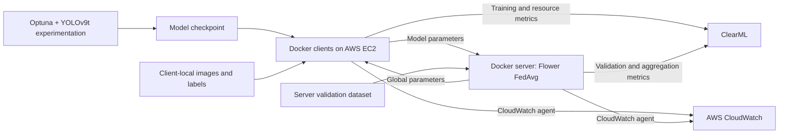

# Federated Driving MLOps

**Distributed YOLOv9 object detection with Flower, Docker, and an AWS-oriented MLOps workflow.**

## Project overview

This project explores how to train an autonomous-driving perception model across distributed clients while keeping each client's training images local. It combines **YOLOv9t object detection**, **Flower federated learning**, separate **Docker client/server environments**, **Optuna hyperparameter optimization**, and **ClearML and CloudWatch monitoring**.

Developed for MSML605 at the University of Maryland, the project connects model experimentation with the operational work of distributed training: exchanging model parameters, aggregating client updates, validating the global model, tracking resource usage, and provisioning consistent client environments on AWS EC2.

The repository contains a research prototype, pretrained checkpoints, an experiment notebook, and project documentation. The [final report](MSML605_Final_Report.pdf) and [presentation](documents/MSML605_Slides.pdf) describe the EC2/AMI deployment and experimental observations; AWS provisioning and autoscaling definitions are not checked in.

## Architecture



AWS EC2 placement and AMI-based client provisioning reflect the documented deployment. The checked-in Dockerfiles define the client and server runtimes.

- **Clients:** [`client/client.py`](client/client.py) implements Flower's `NumPyClient`, loads `best_final.pt`, receives model parameters, trains locally for one epoch, and returns updated parameters. Training uses 256-pixel images and a batch size of four.
- **Server:** [`server/server.py`](server/server.py) extends `FedAvg` to track participation, aggregate updates, validate the global YOLO model, and run five federated rounds. It initially requires three clients and subsequently adjusts its minimum client count based on connected clients.
- **Model safeguard:** the server compares validation **mAP50** with the previous accepted round. A relative drop greater than 10% returns the previous parameters to Flower. This is a performance-regression heuristic, not a statistical test for data drift.
- **Privacy boundary:** Flower exchanges model parameters rather than raw training images. This supports privacy-preserving ML through data locality, but the implementation does not provide differential privacy, cryptographic secure aggregation, or configured TLS. The server also requires its own validation dataset; telemetry and artifact handling need a separate privacy review.

## Tech stack

| Technology | Engineering role | Repository evidence |
| --- | --- | --- |
| Python, PyTorch, Ultralytics YOLOv9t | Object detection, local training, validation, and model-state conversion | Client/server scripts, notebook, and checkpoints |
| Flower | Distributed client/server coordination and FedAvg aggregation | `YOLOClient` and `TimedFedAvg` |
| Docker | Separate client/server environments and startup entrypoints | `client/Dockerfile`, `server/Dockerfile` |
| AWS EC2 and AMIs | Documented cloud deployment and reusable client provisioning | Final report §IV.A and presentation slides 18–19 |
| ClearML | Experiment tracking, hyperparameters, validation scores, participation, and resource metrics | `Task` and `report_scalar` calls in scripts and notebook |
| AWS CloudWatch | Infrastructure monitoring through container-launched agents | Agent configurations for CPU, memory, and disk metrics at 60-second intervals |
| Optuna | Search over training and augmentation hyperparameters to maximize mAP50–95 | `Hyperparameter_Optimizing.ipynb` |
| psutil | CPU, memory, and cumulative client network-byte measurements | Client/server monitoring code |

## Pipeline

1. **Prepare labeled driving images.** The presentation identifies the Udacity Self-Driving dataset distributed through Roboflow. Dataset YAML files define 11 classes covering vehicles, pedestrians, cyclists, and traffic-light states. Images, labels, and final client partitions are not included.
2. **Tune the detector.** The notebook contains baseline, random-search, and Optuna experiments with ClearML tracking. The Optuna objective trains YOLOv9t for 50 epochs and searches learning rate, momentum, weight decay, warmup, hue, mosaic, mixup, rotation, and scale. Its checked-in study requests four trials; pruning callbacks are not implemented.
3. **Initialize federated clients.** Client and server directories include identical `best_final.pt` checkpoints. Each client loads its local dataset and model inside its Docker environment.
4. **Train and aggregate.** Clients exchange parameters with Flower and perform one local epoch per round. The server aggregates successful updates and evaluates the resulting model on its validation data.
5. **Monitor and assess updates.** ClearML records model quality, participation, training time, aggregation time, and system metrics. CloudWatch agents collect infrastructure metrics. The server applies the mAP50 regression safeguard before returning parameters for the next round.
6. **Provision additional clients.** The report describes creating an AMI from a configured EC2 client to reuse its environment. Infrastructure provisioning, Auto Scaling Group policies, and alarm definitions must be supplied separately.

## Results

These are **reported project results**, not measurements rerun from this checkout. mAP50–95 averages detection precision across IoU thresholds from 0.50 to 0.95.

| Metric | Reported value | Evidence and interpretation |
| --- | --- | --- |
| Baseline mAP50–95 | **0.102** | Report Figure 3 and presentation slide 26 show 0.10241. |
| Optimized mAP50–95 | **0.293** | Report §V.A and presentation slide 26 show 0.29314, labeled as the best Optuna result. This is a detector-tuning result, not a measured gain from federated aggregation. |
| Average FL round | **~2.3 minutes** | Historical README claim. Report §V.C instead states five minutes with three clients; the discrepancy is unresolved. |
| Average client startup | **~45 seconds** | Historical README claim. Report §V.C instead states two seconds, while slide 19 describes provisioning in under a minute. Measurement boundaries are not documented consistently. |
| Autoscaling response | **~1 minute** | Historical README claim. No supporting autoscaling benchmark logs or policies are included. |

The timing values are retained for traceability and should not be presented as verified benchmarks. In particular, the server's `Round Duration` metric times only `FedAvg.aggregate_fit`, excluding client training, communication, and validation. The notebook includes partial and interrupted experiments rather than the complete seven-trial sequence shown in the presentation, so it does not independently reproduce the published best score.

## Repository structure

```text
.
├── README.md
├── Hyperparameter_Optimizing.ipynb   # Dataset split and detector tuning experiments
├── MSML605_Final_Report.pdf         # Project methodology, results, and contributions
├── documents/
│   └── MSML605_Slides.pdf           # Architecture and experiment presentation
├── client/
│   ├── client.py                   # Flower NumPyClient and local YOLO training
│   ├── Dockerfile
│   ├── entrypoint.sh               # Starts CloudWatch agent and client
│   ├── requirements.txt
│   ├── data.yaml                   # Client dataset paths and 11 classes
│   ├── clearml.conf
│   ├── cloudwatch-config.json
│   └── best_final.pt
└── server/
    ├── server.py                   # FedAvg, validation, monitoring, rollback heuristic
    ├── Dockerfile
    ├── entrypoint.sh               # Starts CloudWatch agent and server
    ├── requirements.txt
    ├── data.yaml                   # Server validation dataset paths
    ├── clearml.conf
    ├── cloudwatch-container-config.json
    └── best_final.pt
```

## Reproduction and deployment prerequisites

The repository requires environment-specific preparation before it can run:

1. Obtain the driving dataset and create separate client training partitions and a held-out server validation set. Update each `data.yaml` to resolve those paths inside its container. The current client YAML points training, validation, and test to the same `images` directory; use disjoint splits for meaningful evaluation.
2. Replace the hard-coded server endpoint in `client/client.py` with your server address. The server listens on port `8080`; configure connectivity between the intended hosts. `CLIENT_ID` changes the ClearML task name, but does not select a dataset partition.
3. **Replace the credential-bearing ClearML configurations before building images.** Both Dockerfiles copy `clearml.conf` into the image. Remove embedded credential values from your build inputs and supply fresh credentials at runtime using `CLEARML_API_ACCESS_KEY` and `CLEARML_API_SECRET_KEY`, or a private mounted configuration. Previously committed credentials should be revoked and rotated; do not reuse or publish them.
4. Configure AWS region and permissions for CloudWatch, preferably through an EC2 IAM role. Provision EC2 instances and any AMIs, alarms, or scaling policies separately. The Dockerfiles download the Linux AMD64 CloudWatch agent.
5. Resolve and pin compatible dependency versions before a reproducible run. Container requirements are unpinned; the notebook additionally needs Optuna, pandas, and a notebook runtime. Historical notebook output records Python 3.9.18, Ultralytics 8.3.114, and PyTorch 2.6.0+cu126, but this is not a validated container lockfile.

After preparing the dataset paths, endpoint, credentials, and dependencies, build from the repository root:

```bash
docker build -t federated-driving-server:local ./server
docker build -t federated-driving-client:local ./client
```

Start the server container with port `8080` published and validation data mounted, then start clients with distinct training-data mounts and `CLIENT_ID` values. Provide credentials at runtime and keep them outside version control. There is no Docker Compose file or automated cloud deployment command in this repository.

For the tuning notebook, replace machine-specific Windows paths and review the split logic before execution: its folders are named `train_80` and `train_20`, but the current split uses 95%/5% and does not seed the shuffle. The report's class-balancing preprocessing is not supplied as a standalone reproducible pipeline.

## Limitations

- **Research scope:** the documented evaluation uses simulated cloud clients and five FL rounds, with no real-vehicle or edge-device validation. It does not establish production readiness or autonomous-driving safety.
- **Aggregation:** each client reports a fixed sample count of `100`, so FedAvg does not reflect actual unequal partition sizes. There is no custom handling of adversarial updates or asynchronous training. The client does not implement Flower's `evaluate` method, while the strategy retains default federated evaluation settings.
- **Monitoring accuracy:** client round logging defaults to iteration zero because the server does not supply `server_round` in its fit configuration. Network telemetry is a cumulative sent-byte count, not per-round traffic. Checked-in CloudWatch configs collect CPU, memory, and disk metrics, not the custom FL metrics logged to ClearML.
- **Rollback durability:** rejected weights are saved to `server_model.pt` before the regression check; returning prior parameters does not restore that file. The relative-drop calculation also needs handling for a previous mAP50 of zero.
- **Reproducibility:** there are no dependency locks, automated tests, CI workflows, dataset manifests, complete experiment exports, or infrastructure-as-code definitions. Checkpoint provenance is not linked to a complete winning trial export.
- **Evidence limits:** timing claims conflict across documents, and the notebook's baseline configurations and trial sequence differ from the report. The containerized/non-containerized comparison is reported in the PDF, but does not isolate Docker as the cause of accuracy differences.
- **Privacy and deployment hardening:** parameter exchange alone is not a formal privacy guarantee. Credential management, transport security, secure aggregation, and infrastructure automation require further work.

## Contributors

Contributions below follow §VII of the final report, with monitoring behavior described according to the checked-in implementation.

| Contributor | Contribution |
| --- | --- |
| **Nikita Miller** | MLOps monitoring with ClearML and CloudWatch; experiment tracking and visualization; contributions to model-performance regression detection. |
| **Aariz Faridi** | Flower federated-learning pipeline, client instantiation logic, and YOLOv9 integration. |
| **Anisha Katiyar** | Data augmentation, Optuna search-space configuration, hyperparameter optimization, and model analysis. |
| **Yatish Sikka** | Docker client/server architecture and the documented EC2/AMI deployment and recovery workflow. |

## Project documentation

- [Final report](MSML605_Final_Report.pdf): methodology, experiment figures, deployment observations, and team contributions.
- [Presentation](documents/MSML605_Slides.pdf): dataset context, architecture, tuning results, and demonstration overview.
- [Hyperparameter optimization notebook](Hyperparameter_Optimizing.ipynb): experiment code and retained training outputs.
